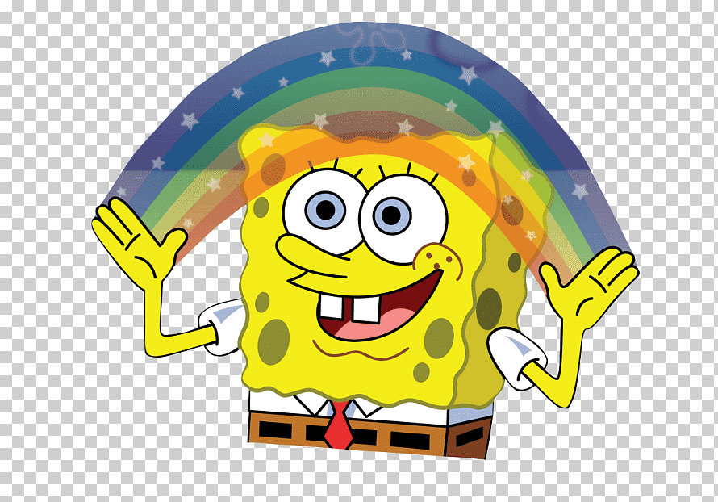
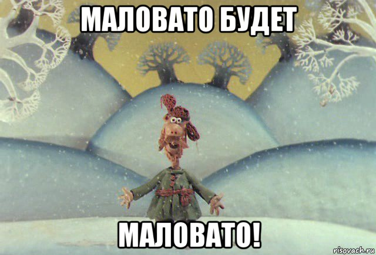

# Визуализация данных с `ggplot2`

## Визуализация это зачем?

Вопрос не праздный, ибо что мы зря 100500 видов описательных статистик считали? Однако всё не так просто. Рассмотрим пример.

У нас есть датасет Квартет Анскомба[^1], который выглядит так (первые десять строк):

[^1]: Anscombe, F. J. (1973) “Graphs in Statistical Analysis”

```{r, echo=FALSE, message=FALSE}
library(tidyverse)
library(knitr)
```

```{r, echo=FALSE, message=FALSE}
anscombe <- read_csv("https://raw.githubusercontent.com/angelgardt/hseuxlab-wlm2021/master/data/anscombe.csv")
anscombe %>% head(10) %>% kable()
```

Если мы посчитаем описательные статистики в каждом субдатасете, то получим следующее:

```{r, echo=FALSE, message=FALSE}
anscombe %>% 
  group_by(dataset) %>% 
  summarise(mean_x = mean(x),
            mean_y = mean(y),
            sd_x = sd(x),
            sd_y = sd(y),
            cor = cor(x, y),
            n_obs = n()) %>% 
  kable(digits = 2)
```

Ребят, тут всё идентично!

<center>

</center>


Однако давайте нарисуем:

<center>
```{r, echo=FALSE, message=FALSE}
anscombe %>% 
  ggplot(aes(x, y)) + 
  geom_point(size = 2) + 
  geom_smooth(method = "lm") + 
  facet_wrap(~ dataset) +
  theme_bw()
```
</center>


Што?

<center>

</center>


Мы обнаружили в явном виде, что несмотря на идентичные значения описательных статистик, паттерны в данных могут быть различны.

Чтобы впечатлиться окончательно, посмотрим на Datasaurus[^2]:

[^2]: Matejka and Fitzmaurice (2017) “Same Stats, Different Graphs”

```{r, echo=FALSE, message=FALSE}
read_csv("https://raw.githubusercontent.com/angelgardt/hseuxlab-wlm2021/master/data/datasaurus.csv") -> dino
dino %>%
  group_by(dataset) %>% 
  summarize(mean_x = mean(x),
            mean_y = mean(y),
            sd_x = sd(x),
            sd_y = sd(y),
            cor = cor(x, y),
            n_obs = n()) %>% 
  kable(digits = 1)
```

<center>
```{r, echo=FALSE, message=FALSE}
dino %>% ggplot(aes(x, y)) +
  geom_point() +
  facet_wrap(~ dataset) +
  theme_bw()
```
</center>

<center>

</center>

К чему это всё? К тому, что визуализация данных является жизненно необходимым этапом разведочного анализа. Она позволяет вам глубже и детальнее понять, что происходит в данных, и как это происходящее может отразиться на дальнейшем анализе.


```{r, echo=FALSE, eval=FALSE}
## Какие бывают графики?

#Чтобы понимать, как визуализировать наши данные, нужно сориентироваться в том, какие вообще у нас есть возможности.

#### Столбчатая диаграмма (Bar Graph)

#### Лучевая диаграмма (Sunburts)

#### Круговая диаграмма (Pie Chart)

#### Линейная диаграмма (Line Graph)

#### Диаграмма рассеяния (Scatter Plot)

#### Пузырьковая диаграмма (Bubble Chart)

#### Гистрограмма (Histogram)

#### График плотности вероятности (Density plot)

#### Ящик с усами (Boxplot)

#### График интервальных оценок (Error Bar)
```


##  Философия A Layered Grammar of Graphics

Идея, воплолщенная в одном из мощнейших пакетов для визуализации `ggplot2`, восходит к работе [L. Wilkinson «The Grammar of Graphics»](https://www.springer.com/gp/book/9780387245447). Базируясь на идеях, изложенных в этой работе, Hadley Wickham разработал концепцию [Layered Grammar of Graphics](https://doi.org/10.1198/jcgs.2009.07098) и создал пакет для визуализации, ради которого мы все здесь собрались. Автором по этому пакету написана целая [книга](https://www.springer.com/gp/book/9780387981413), но мы сосредоточимся на основных смысловых и ключевых моментах, которые необходимы, чтобы сделать что-то крутое.


> Часто возникает вопрос: почему 2? Ответ примерно такой: был и первый ggplot, но попытка не задалась от слова совсем, и пришлось все переделать.


По своей сути график представляет собой сложную аппликацию из нескольких слоев. На каждом слое располагаются сходные по содержанию элементы. Начиная с самого первого --- базового --- и постепенно добавляя слой за слоем необходимые элементы, можно создавать сложные визуализации для отображения интересных закономерностей в данных.

После создания базового графика осуществляется настройка отдельных элементов по необходимости и в зависимости от требований издательства / преподавателя / научника / комиссии и т.д. И поскольку все элементы в определенной степени изолированы друг от друга, это открывает большие возможности кастомизации. Кроме того, чтобы оформить график в соответствии с конкретными требованиями, нет необходимости перерисовывать его целиком, так как содержательная часть графика независима от настроек внешнего облика. Все, что вам нужно --- это добавить/удалить пару строк кода.

Но --- хватит слов! Поехали уже рисовать уже!


## Экшон

### Пакеты

Для рисования нам понадобится пакет `ggplot2`. Если вы ранее его никогда не устанавливали, то воспользуйтесь такой командой:

```{r, eval=FALSE}
install.packages("ggplot2")
```

Проверить, установлен пакет или нет, можно так:

```{r}
"ggplot2" %in% installed.packages()
```

После установки пакета его необходимо подключить к текущей сессии, чтобы мы могли пользоваться функциями, которые в нём лежат:

```{r}
library(ggplot2)
```


### Данные

Чтобы не ворочаться с загрузкой данных, воспользуемся для освоения мощностей ггплота встроенным в него датасетом `diamonds`:

```{r}
head(diamonds)
```

Описание датасета примерно такое:

```{r, echo=FALSE}
tibble(
  Variable = c("price", "carat", "cut", "color", "clarity", "x", "y", "z", "depth", "table"),
  Description = c("price in US dollars", "weight of the diamond	", "quality of the cut", "diamond color", "measurement of how clear the diamond is", "length in mm", "width in mm", "depth in mm", "total depth percentage", "width of top of diamond relative to widest point"),
  Values = c("$326-$18,823", "0.2-5.01", "Fair, Good, Very Good, Premium, Ideal", "J (worst) to D (best)", "I1 (worst), SI2, SI1, VS2, VS1, VVS2, VVS1, IF (best)", "0-10.74", "0-58.9", "0-31.8", "43-79", "43-95")
) %>% kable()
```

Но этот датасет очень большой --- 53k наблюдений. Нам для освоения возможностей визуализации пока этого многовато. Давайте сделает случайную подвыборку из 1000 наблюдений:

```{r}
set.seed(34)
diamonds1000 <- diamonds %>% slice(sample(1:nrow(diamonds), 1000, replace = FALSE))
```


### Строим базовый график

#### Базовый слой

Первое, что мы делаем, когда собираемся что-либо рисовать — берем холст.

Аналогично, когда мы собираем рисовать график с использованием `ggplot2`, первое, что мы делаем --- говорим «Дай мне холст!». На языке `ggplot2` это делается с помощью команды `ggplot()`.

```{r}
ggplot()
```


И, о Боже, `ggplot2` дал нам холст! Иначе говоря, мы построили _базовый слой_, на который в дальнейшем будем набрасывать элементы нашего графика.

Следующее, что необходимо сделать --- указать данные, на основе которых мы будем строить наш график. Это делается к помощью аргумента `data`:

```{r}
ggplot(data = diamonds1000)
```

Вроде бы ничего не изменилось, да и собственно, не должно было, ведь мы никак не указали, что мы хотим отобразить. Давайте укажем.


#### Разметка осей и переменные. Эстетики

Важнейшие элементы любого графика --- это оси. Мы строим двумерные графики, поэтому и оси у нас две --- как учили в школе, _x (горизонтальная ось, ось абсцисс)_ и _y (вертикальная ось, ось ординат)_.

Чтобы задать оси графика потребуется отдельная функция. Она называется `aes()`, и в общем задает _эстетики_ графика.

Итак, конкретнее об эстетиках. Иначе говоря, это то _форматирование, которое связано с данными_. Или еще один способ понимания --- способы отображения переменных из датасета. У функции `aes()` есть ряд параметров, они тоже называются _эстетики_.


<a name="aes_list"></a>
Вот список эстетик, которые используются чаще всего:

* `x`
* `y`
* `color`
* `fill`
* `shape`
* `size`
* `linetype`

Несложно догадаться, что переменные по осям задаются параметрами x и y. Что ж, зададим.

Давайте визуализируем связь между весом и ценой бриллианта:

```{r}
ggplot(data = diamonds1000, aes(x = carat, y = price))
```

Так, ну, допустим… Оси разметились. А где картинка?

Картинки нет, но `ggplot2` честно отработал свою работу. Мы задали только оси --- и он нам разметил их в соответствии с имеющимися в векторах значениях. Больше мы ему ничего не написали. Чтобы всё-таки получить картинку, необходимо указать, как мы хотим отборазить наши переменные.


#### Геомы 

За то, каким образом будут отображены переменными, а конкретно, какими «геометрическими объектами», отвечает семейство функций `geom_*`. Когда мы переходим к этой функции, мы ступаем на новый слой. Чтобы это обозначить используется «плюсик» (`+`).

```{r}
ggplot(data = diamonds1000, aes(x = carat, y = price)) +
  geom_point()
```


Мы выбрали точки для отображения наблюдений, потому что наиболее наглядный вариант отобразить зависимость между двумя переменными. Такой тип графика называется scatterplot, или диаграмма рассеяния.

Но, вообще-то, можно и получше отобразить закономерность. Как минимум, добавить линию тренда в помощью специального геома:

```{r}
ggplot(data = diamonds1000, aes(x = carat, y = price)) +
  geom_point() +
  geom_smooth()
```


Как видите, при добавлении нового «геометрического» способа отображения данных мы добавляем новый слой.

`geom_smooth()` подразумевает «сглаживание», оно может происходить с помощью разных методов (используемый метод нам написали в консоль). Мы можем эскплицитно указать метод, который хотим использовать. Например, линейную регрессию:

```{r}
ggplot(data = diamonds1000, aes(x = carat, y = price)) +
  geom_point() +
  geom_smooth(method = 'lm')
```


<div style="margin-top: 5%">
<div style="padding: 1%; margin: 1%; background-color: #307dce; border-radius: 10px">
<div style="padding-left: 1%; font-weight: bold; color: white">Задание</div>
</div>

<div style="padding: 1% 3% 1% 3%; margin: 2% 1% 1% 1%; background-color: #e0f0fa; border-radius: 10px">

Используя тот же датасет `diamonds1000`, визуализируйте связь между длиной и шириной бриллиантов.

<details>
<summary>Референс</summary>

```{r, echo=FALSE, message=FALSE}
diamonds1000 %>% 
  ggplot(aes(x, y)) +
  geom_point() +
  geom_smooth()
```
</details>

</div>

</div>


В случае, если нас интересует распределение нашей переменной, мы можем использовать `geom_histogram()` или `geom_density()`:

```{r}
ggplot(data = diamonds1000,
       aes(x = price)) +
  geom_density()
```

Кстати, аргументы функции можно передавать и без указания их имён --- `R` будет ориентироваться по их порядку:

```{r}
ggplot(diamonds1000,
       aes(price)) +
  geom_histogram()
```

При рисовании гистограммы для обнаружения деталей в распределении можно задать ширину столбика --- например, сделать её более мелкой:

```{r}
ggplot(diamonds1000,
       aes(price)) +
  geom_histogram(binwidth = 100)
```

Для отображения распределений мы также можем использовать боксплот --- это отдельный геом:

```{r}
ggplot(diamonds1000,
       aes(y = price)) +
  geom_boxplot()
```

Чуть позже мы столкнемся ещё c некоторыми геомами, но вот вам сразу список самых полезных для старта:

* `geom_histogram()`
* `geom_density()`
* `geom_boxplot()`
* `geom_point()`
* `geom_errorbar()`
* `geom_pointrage()`
* `geom_line()`
* `geom_vline()`
* `geom_hline()`
* `geom_smooth()`


<div style="margin-top: 5%">
<div style="padding: 1%; margin: 1%; background-color: #307dce; border-radius: 10px">
<div style="padding-left: 1%; font-weight: bold; color: white">Вопрос</div>
</div>

<div style="padding: 1% 3% 1% 3%; margin: 2% 1% 1% 1%; background-color: #e0f0fa; border-radius: 10px">

График плотности вероятности, гистограмма и боксплот --- все три визуализации отображают распределение. Для чего каждая из них может быть полезна?

_В помощь картинка ниже._


<center>
```{r, echo=FALSE, message=FALSE}
gridExtra::grid.arrange(
  diamonds1000 %>% 
    ggplot(aes(x = price)) +
    geom_density(),
  diamonds1000 %>% 
    ggplot(aes(x = price)) +
    geom_histogram(binwidth = 50),
  diamonds1000 %>% 
    ggplot(aes(x = price)) +
    geom_boxplot() +
    labs(y = "c") +
    theme(axis.title.y = element_text(colour = "white"),
          axis.text.y = element_text(colour = "white"))
)
```
</center>
</div>

</div>


<div style="margin-top: 5%">
<div style="padding: 1%; margin: 1%; background-color: #307dce; border-radius: 10px">
<div style="padding-left: 1%; font-weight: bold; color: white">Задание</div>
</div>

<div style="padding: 1% 3% 1% 3%; margin: 2% 1% 1% 1%; background-color: #e0f0fa; border-radius: 10px">

Визуализируйте распределение веса бриллиантов (переменная `carat`). Выберите один из возможных способов визуализации распределения. Можете визуализировать несколькими способами и сравните результаты.

</div>

</div>


### Ищем более сложные закономерности

Пока что мы работали только с одной-двумя переменными, однако на практике нас могут интересовать более сложные взаимосвязи. Например, в случае с бриллиантами распределение цены по всему датасету даёт нам весьма мало информации, поскольку есть много факторов, которые на неё могут влиять --- размер бриллианта, качество огранки и др. Пропробуем их отобразить.


#### Группировка по переменной

Один из вариантов того, что мы можем сделать, это сгруппировать наши наблюдения по какой-либо из переменных. Как группировка будет выражена в коде сильно зависит от типа визуализации. Разберем на двух примерах.

Выше мы рисовали вот такой боксплот, который отображает распределение цены:

```{r}
ggplot(diamonds1000,
       aes(y = price)) +
  geom_boxplot()
```

Однако вполне ожидаемо, что цена может быть по-разному распределена в зависимости от качества огранки. В нашем датасете есть переменна `cut`, и нам было бы хорошо отобразить её на графике. Так как боксплоты требуют по оси `x` _категориальную_ переменную, то сделать это достаточно просто:

```{r}
ggplot(diamonds1000,
       aes(x = cut, y = price)) +
  geom_boxplot()
```

Вот мы уже видим много чего: в группах `Good` и `Premium` распределение симметричное, а во всех остальных скошенное. Также мы наблюдаем, что чем выше качество огранки, тем больше _выбросов_ в группе.

Если мы визуализируем распределение в помошью, например, графика плотности вероятности, то задание группировки в помощью эстетики `x` нам не подойдёт: она уже занята нашей переменной `price`. Эстетика `y` в этой визуализации рассчитывается автоматически, поэтому её мы тоже не можем использовать --- да и как мы по не вообще смогли бы задать группировку? Значит нам необходимо использовать какую-то другую эстетику. Пусть это будет `fill`:

```{r}
ggplot(diamonds1000,
       aes(x = price, fill = cut)) +
  geom_density()
```

<a name="alpha"></a>

Обратите внимание, что теперь у нас справа появилась легенда, которая позволяет понять, что отображено тем или иным цветом. Однако пока визуализация не очень хороша, так как распределения перекрывают друг друга. Чтобы это поправить, нужно задать позрачность с помощью аргумента `alpha` в функции `geom_density()`:

```{r}
ggplot(diamonds1000,
       aes(x = price, fill = cut)) +
  geom_density(alpha = .5)
```

Теперь мы видим все распределения на одном графике. Классно? Классно!

<center>

</center>


<div style="margin-top: 5%">
<div style="padding: 1%; margin: 1%; background-color: #307dce; border-radius: 10px">
<div style="padding-left: 1%; font-weight: bold; color: white">Задание</div>
</div>

<div style="padding: 1% 3% 1% 3%; margin: 2% 1% 1% 1%; background-color: #e0f0fa; border-radius: 10px">

В нашем датасете есть переменная `depth`, которая обозначает total depth percentage[^6]. Каково распределение этой величины у бриллиантов разного цвета (переменная `color`)?

[^6]: Что бы это ни значило…

</div>

</div>


#### Больше переменных

Это всё, конечно, хорошо, но мы пока что не вышли за пределы двух переменных на одном графике.

<center>

</center>

Вспомним нашу диаграмму рассенияния «Вес --- Цена»:

```{r}
ggplot(data = diamonds1000, aes(x = carat, y = price)) +
  geom_point()
```

Уберём линию тренда, она нам будет мешать.

Как бы нам сделать так, чтобы на этот график добавить переменную `depth`?

<div style="margin-top: 5%">
<div style="padding: 1%; margin: 1%; background-color: #307dce; border-radius: 10px">
<div style="padding-left: 1%; font-weight: bold; color: white">Вопрос</div>
</div>

<div style="padding: 1% 3% 1% 3%; margin: 2% 1% 1% 1%; background-color: #e0f0fa; border-radius: 10px">

Вернитесь к списку [эстетик](#aes_list). `x` и `y` у нас заняты. Предложите, какую эстетику мы могли бы использовать для отображения переменной `depth`?

</div>

</div>


Возможно несколько вариантов --- я предлагаю использовать `size`:

```{r}
ggplot(data = diamonds1000,
       aes(x = carat,
           y = price,
           size = depth)) +
  geom_point()
```


В целом, получилось неплохо, но сейчас на графике происходит небольшой флекс. Надо немножко поправить, чтобы происходил чилл.

Точки и раньше накладывались друг на друга, однако теперь в силу того, что размер точки для нас информативен, наложение стало критично. С наложением элементов друг на друга мы боролись [чуть выше](#alpha). Можем попробовать аналогичный способ:

```{r}
ggplot(data = diamonds1000,
       aes(x = carat,
           y = price,
           size = depth)) +
  geom_point(alpha = .3)
```

Получилась пузырькая диаграмма. Ну, неплохо.

<center>

</center>

<div style="margin-top: 5%">
<div style="padding: 1%; margin: 1%; background-color: #307dce; border-radius: 10px">
<div style="padding-left: 1%; font-weight: bold; color: white">Задание</div>
</div>

<div style="padding: 1% 3% 1% 3%; margin: 2% 1% 1% 1%; background-color: #e0f0fa; border-radius: 10px">

Выше мы рисовали диаграмму рассеяния, которая отображала связь между длиной (`x`) и шириной (`y`) бриллианта. Возьмите за основу получившийся график и превратите его в пузырьковую диаграмму, которая будет отображать связь между (`x`), шириной (`y`) и глубиной (`z`) бриллианта.

<details>
<summary>Референс</summary>

```{r, echo=FALSE, message=FALSE}
diamonds1000 %>% 
  ggplot(aes(x, y,
             size = z)) +
  geom_point(alpha = .1)
```

</details>

</div>

</div>


На фоне успешной работы с прозрачностью элементов мы словили состояние потока, и хотим добавить ещё переменных!

<center>

</center>


Круто было бы отобразить, как зависит цена от `carat` и `depth` у бриллиантов различного качества огранки. Переменную `cut` мы уже отображали --- здесь использованный подход тоже сработает:

```{r}
ggplot(data = diamonds1000,
       aes(x = carat,
           y = price,
           size = depth,
           color = cut)) +
  geom_point(alpha = .3)
```


Ммм, красота!

<center>

</center>


### Важное замечание о визуализации

<div style="margin-top: 5%">
<div style="padding: 1%; margin: 1%; background-color: #307dce; border-radius: 10px">
<div style="padding-left: 1%; font-weight: bold; color: white">Вопрос</div>
</div>

<div style="padding: 1% 3% 1% 3%; margin: 2% 1% 1% 1%; background-color: #e0f0fa; border-radius: 10px">

Как определить, что визуализация хороша?

</div>

</div>

Можно придумать огромное количество критериев. На мой взгляд, критические параметры таковы:

* **Честность**
    - график отображает то, что реально поисходит в данных
* **Читаемость**
    - выбран корретных способ визуализации
    - график удобно рассматривать и понимать, что происходит
* **Дизайн**
    - подобрана корректная палитра, все цвета хорошо видны и отличимы друг от друга
    - подобраны адекватные шрифты
* **Качество картинки**
    - график хорошего разрешения

Прочекаем наш график по этим параметрам:

* Честность --- ОК
    - мы работаем с теми данными, котрые у нас есть и не модифицируем их в угоду каким-либо нашим целям; да, мы сейчас работаем на части датасета, но делаем это исключительно в учебных целях
* Читаемость --- нутакое
    - способ визуализации мы выбрали корректный --- пузырькая диаграмма, которая у нас получилась, вполне подходит для отображения интересующих нас закономерностей
    - но понимать, что происходит в левом нижнем углу сложновато
* Дизайн --- приемлемо
    - хотя есть некоторые вопросы к используемой стандартеной палитре, на данном этапе это окей, кастомизировать график мы научимся далее
* Качество картинки --- приемлемо
    - пока что мы может не задумываться об этом, так как не выгружаем график в файл для публикации или отчёта, однако надо будет не забывать об этом позднее
    
Итого, у нас хромает крайне существенный парамет --- **читаемость**. Когда мы строим визуализацию, мы должны четко понимать, зачем мы это делаем, и в конечном итоге *мы рисуем картинки для нашего читателя*. Нам важно позабиться о том, чтобы нашу визуализацию было удобно читать и понимать тому, кто с ней сталкивается впервые --- то есть сделать её максимально понятной. Давайте поработаем на этим.


<div style="margin-top: 5%">
<div style="padding: 1%; margin: 1%; background-color: #307dce; border-radius: 10px">
<div style="padding-left: 1%; font-weight: bold; color: white">Вопрос</div>
</div>

<div style="padding: 1% 3% 1% 3%; margin: 2% 1% 1% 1%; background-color: #e0f0fa; border-radius: 10px">

Как можно изменить график, чтобы он был более читаемым и лучше отображал интересующие нас закономерности?

</div>

</div>


#### Фасетирование

Один из способов сделать визуализацию понятнее --- использовать **фасетирование**. Оно позволяет разбить график на несколько субграфиков по некоторой категориальной переменной. Таким образом, на каждом субграфике окажется меньше данных, поэтому каждый из них будет проще читать. Вместе с тем все субграфики будут располагаться рядом друг с другом, поэтому их будет удобно сравнивать.

Для фасетирования существует два варианта: `facet_grid()` и `facet_wrap()`. Первый удобен, когда у вас две (и более) группирующий переменных, второй --- когда такая переменная одна. У нас сейчас группировка по одной переменной `cut`, поэтому мы будем использовать второй вариант:

```{r}
ggplot(data = diamonds1000,
       aes(x = carat,
           y = price,
           size = depth,
           color = cut)) +
  geom_point(alpha = .3) +
  facet_wrap(~ cut)
```

Отлично, наши наблюдения зазбилить по субграфикам и в целом визуализация стала чуть более читаемой. Хотя, конечно, большие скопления точек слева внизу всё равно остались[^3].

[^3]: Вообще об этом стоило подумать, когда мы смотрели на распределения переменной `price` и видели, что у нас очень много «дешёвых» бриллиантов и мало «дорогих». Но это уже следующий этап погружения в анализ картинок. Нам бы пока с возможностями ггплота разобраться…

Внимательно посмотрим на получившийся график: переменная `cut` у нас отображена двумя разными способами --- цветом и фасетированием. Это не оч. хор. --- возникла _избыточность_. Когда читатель будет смотреть на этот график, он озадачится, так как, скорее всего, будет ожидать, что каждая переменная отбражена _единственным_ способом. Пока он разберется, что цвет не несет дополнительной информации, он будет тратить время --- это нехорошо. Поэтому цвет надо либо убрать вовсе --- и это лучший вариант, либо как минимум скрыть цветовую легенду.

```{r}
ggplot(data = diamonds1000,
       aes(x = carat,
           y = price,
           size = depth)) +
  geom_point(alpha = .3) +
  facet_wrap(~ cut)
```


Вот так хорошо --- дублирования информации теперь нет.


<div style="margin-top: 5%">
<div style="padding: 1%; margin: 1%; background-color: #307dce; border-radius: 10px">
<div style="padding-left: 1%; font-weight: bold; color: white">Задание</div>
</div>

<div style="padding: 1% 3% 1% 3%; margin: 2% 1% 1% 1%; background-color: #e0f0fa; border-radius: 10px">

Я тут в сносках упоминал, что нам стоило бы внимательнее посмотреть на распределение переменной `price`. Давайте это сделаем! Визуализируйте распределение этой переменной в зависимости от качества огранки (`cut`) и цвета (`color`). Властью данной мне мною налагаю запрет на использование эстетик (кроме обязательной --- `x`)!

<details>
<summary>Подсказка</summary>
[`facet_grid`](https://ggplot2.tidyverse.org/reference/facet_grid.html)
</details>

<details>
<summary>Вариант референса</summary>

```{r, echo=FALSE, message=FALSE}
diamonds1000 %>% 
  ggplot(aes(price)) +
  geom_histogram() +
  facet_grid(cut ~ color)
```

</details>
</div>

</div>


<div style="margin-top: 5%">
<div style="padding: 1%; margin: 1%; background-color: #0044aa; border-radius: 10px">
<div style="padding-left: 1%; font-weight: bold; color: white">Сложное задание</div>
</div>

<div style="padding: 1% 3% 1% 3%; margin: 2% 1% 1% 1%; background-color: #e0f0fa; border-radius: 10px">

Часто нам бывает полезно знать, как расположено распределение по какой-либо группе наблюдений в контексте всего распредления переменной. Доработайте предыдущий график так, чтобы на каждом субграфике распределение цены в каждом из сочетаний условий `color` x `cut` лежало поверх распределения всей переменной `price`. Это должно выглядеть так:


```{r}
diamonds1000 %>% 
  ggplot(aes(price)) +
  geom_histogram(data = diamonds1000 %>% select(-cut, -color))+
  geom_histogram(fill = "white") +
  facet_grid(cut ~ color)
```

Серые гистограммы --- распределение по всей переменной `price`, белые (маленькие внизу) --- распределения цены в каждом из сочетаний условий `color` x `cut`.

</div>

</div>


### Инструменты встроенной статистической обработки

Досих пор мы отображали _«сырые данные»_ --- то есть то, что непосредственно есть в данных. Однако часто бывает так, что мы хотим отобразить какие-то посчитанные статистики, или _аггрегированные данные_. Поэтому необходимо сначала предобработать данные, получить необходимые значения и затем на их основе построить график.

Но зачем? Если можно сразу в коде построения графика рассчитать все, что нам нужно! В `ggplot2` уже встроены инструменты простейшей статистический обработки!

Еще раз посмотрим на датасет. У нас есть переменная `price`, а также категории качества огранки `cut`. Наверняка, средняя цена будет различаться в этих категориях. Давайте это проверим! Но сначала нам необходимо познакомиться с новым семейством функций `stat_*`.


#### Статы

Статы и есть те самые встроенные инструенты статистической обработки. Они позволяют прямо в коде графика обсчитать данные и сразу же визуализировать результаты.

> На самом деле, мы уже сталкивались со встроенными инструментами статистической обработки, ведь что делает `geom_smooth(method = 'lm')`? Не что иное, как визуализирует линейную регрессию, построенную на выбранных данных!

Наиболее популярная функция из рассматриваемого семейста --- `stat_summary()`. С помощью неё мы и будем визуализировать наши средние.

> Обратите внимание, что теперь мы будем работать с полным датасетом `diamonds`!

Приступим к построению графика. Начнём с базового слоя:

```{r}
ggplot(diamonds,
       aes(cut, price)) # напоминаю, что аргументы функции можно передавать просто по порядку, не указывая имя самого аргумента
```

Взяли холст, расчертили. По оси _x_ у нас будет идти группирующая переменная. Теперь добавим средние. Как и полагается, на новый слой.

```{r}
ggplot(diamonds,
       aes(cut, price)) +
  stat_summary(fun = mean, geom = 'point')
```

Разберемся, что тут написано. Первый аргумент (`fun`) принимает функцию, результат которой будет отложен по оси _y_. В нашем случае это среднее (`mean`). Она будет применена к переменой `price`, причем наблюдения будут автоматически сгруппированы по интересующим нас группам (`cut`). Второй аргумент --- это уже знакомый нам `geom`, которые отвечает за то, как «геометрически» будут отрисованы знаечния на графике. Наш выбор --- точки. Как результат мы наблюдаем то, что хотели.

Однако как мы знаем из статистики, чтобы определить, есть ли различия между группами, нам недостаточно только средних значений --- необходимы доверительные интервалы. Что ж, отобразим и их.

Добавим новый слой с помощью всё той же функции `stat_summary()`, но на этот раз она будет выглядеть немного по-другому:


```{r}
ggplot(diamonds,
       aes(cut, price)) +
  stat_summary(fun = mean, geom = 'point') +
  stat_summary(fun.data = mean_cl_boot, geom = 'errorbar')
```

Как мы видим, немного изменился первый аргумент. Это связано с изменением геома. Для отображения доверительных интервалов нам нужен геом `errorbar`, который требует не одно значение, а два --- верхнюю и нижнюю границу доверительного интервала. То есть `fun.data` принимает как аргумент мини-датафрейм --- как раз в таком формате и возвращается результат функции `mean_cl_boot`. Можно посмотреть на её работу отдельно:

```{r}
mean_cl_boot(diamonds$price)
```

Собственно, вот он датафрейм из одной строки. Здесь три значения, но `errorbar` игронирует первое (само среднее значение) и использует только второе и третье, строя по ним «усы».


<div style="margin-top: 5%">
<div style="padding: 1%; margin: 1%; background-color: #307dce; border-radius: 10px">
<div style="padding-left: 1%; font-weight: bold; color: white">Задание</div>
</div>

<div style="padding: 1% 3% 1% 3%; margin: 2% 1% 1% 1%; background-color: #e0f0fa; border-radius: 10px">

С ценой разобрались. Теперь давайте сравним вес бриллиантов в разных группах. Визуализируйте средние значения веса бриллиантов (`carat`) в группах по степени чистоты (`clarity`). Не забудьте про доверительные интервалы!

</div>

</div>


Однако мы продолжваем гнаться за сложными закономерностями, поэтому добавим ещё одну группирующую переменную. В наших данных есть переменная `color`, которая задаёт «цвет» бриллианта. Наверное, он тоже может влиять на цену камня.

```{r}
ggplot(diamonds,
       aes(cut, price,
           color = color)) + # не путайтесь: первый color ---  название аргумента, второй --- имя переменной)
  stat_summary(fun = mean, geom = 'point') +
  stat_summary(fun.data = mean_cl_boot, geom = 'errorbar')
```


Ёжкины коты, красота-то какая! Только надо как-то это в божеский вид привести…

<center>

</center>


### Настраиваем график

`ggplot2` имеет широчайшие возможности кастомизации, в нем можно настроить чуть более, чем всё. Сейчас наш график выглядит хотя и содержательно верно, но с точки зрения дизайна (да и общей адекватности) --- совершенно дико. Давайте подправим.

Первое, что бросается в глаза --- точки и «усы» лежат друг на друге, что очень нехорошо и так не надо: крайне трудно понять, что происходит на графике. Давайте их расположим рядом друг с другом, чтобы оставалось видно, что средние сгрупированы по делениям оси _x_.

Это делается с помощью функции `position_dodge(),` которая создает объект задающий позицию точек. Результат её работы необходимо передать в аргумент `position` конкретного стата, но так как у нас статов несколько, прописывать 100500 раз одно и то же --- неразумно. К тому же, если мы захотим как-то поменять расположение точек (сблизить, раздвинуть сильнее), нам надо будет переписывать каждую строку --- всё ещё неразумно. Поэтому мы сделаем отдельный объект, в который рапишем результат работы функции:

```{r}
pd <- position_dodge(0.5) # передаем какое-то число из диапазона [0, 1]
```

И далее будем использовать этот объект:

```{r}
ggplot(diamonds,
       aes(cut, price,
           color = color)) + 
  stat_summary(fun = mean, geom = 'point',
               position = pd) +
  stat_summary(fun.data = mean_cl_boot, geom = 'errorbar',
               position = pd)
```

Ну, вот стало уже поприличней.

Второе, что бросается в глаза --- слишком широкие `errorbar`’ы (они касаются усов соседних точек). Значит, надо уменьшить ширину. За их ширину отвечает параметр `width`. Ширина задается долями единицы.

```{r}
ggplot(diamonds,
       aes(cut, price,
           color = color)) + 
  stat_summary(fun = mean, geom = 'point',
               position = pd) +
  stat_summary(fun.data = mean_cl_boot, geom = 'errorbar',
               position = pd, width = .5)
```

Вот так вроде хорошо, хвосты `errorbar`’ов ни с чем не пересекаются.

Что ты еще хотелось подправить? Наверное, сделать акцент на главных смысловых элементах графика. В нашем случае это точки. Давайте сделаем их побольше.

```{r}
ggplot(diamonds,
       aes(cut, price,
           color = color)) + 
  stat_summary(fun = mean, geom = 'point',
               position = pd, size = 2) +
  stat_summary(fun.data = mean_cl_boot, geom = 'errorbar',
               position = pd, width = .5)
```

Вот теперь кайф!


#### Темы

Но не совсем. Фон какой-то не очень… Дефолтная серая тема в какое-то давнее время была популярна, все выдели что ты крутой и умеешь в ггплот и ваще. Однако со временем это стало #немодно, и лучше серой темы избегать, да и требования журналов обычно более строгие.

В `ggplot2` есть ряд встроенных тем, которые задаются через функции семейства `theme_*()`. Наиболее популярные `theme_classic()` и `theme_bw()`. Последнюю мы и будем использовать.

```{r}
ggplot(diamonds,
       aes(cut, price,
           color = color)) + 
  stat_summary(fun = mean, geom = 'point',
               position = pd, size = 2) +
  stat_summary(fun.data = mean_cl_boot, geom = 'errorbar',
               position = pd, width = .5) +
  theme_bw()
```

Ах, красота!

<div style="margin-top: 5%">
<div style="padding: 1%; margin: 1%; background-color: #307dce; border-radius: 10px">
<div style="padding-left: 1%; font-weight: bold; color: white">Задание</div>
</div>

<div style="padding: 1% 3% 1% 3%; margin: 2% 1% 1% 1%; background-color: #e0f0fa; border-radius: 10px">

Возьмите график из последнего задания.

1. Модифицируйте код так, чтобы он отображал средние значения веса блиллиантов (с доверительными интервалами) для групп бриллиантов по переменным `clarity` x `cut`. Можете использовать любые эстетики. 

2. Настройте график, так, чтобы он был читаем. За референс возьмите визуализацию выше. Поправьте положение точек и эррорбаров, ширину «усов», измените стандартную тему на любую другую.

</div>

</div>


#### Кастомизация шкал

Мы задали отображение групп цвета бриллиантов цветом[^5], но дефолтная шкала не совсем хороша, как минимум потому, что в ней есть жёлтый, который на нашем белом фоне будет смотреться не очень. Надо бы это поправить.

Для того, чтобы кастомизировать используемые шкалы, есть ряд функций семейства `scale_*()`. Мы познакомимся с некоторыми из них. Для начала изменим цвета.

В R можно задавать цвета через названия или HEX кодировку. Будем использовать названия.

[^5]: Мы такие оригинальные!

```{r}
ggplot(diamonds,
       aes(cut, price,
           color = color)) + 
  stat_summary(fun = mean, geom = 'point',
               position = pd, size = 2) +
  stat_summary(fun.data = mean_cl_boot, geom = 'errorbar',
               position = pd, width = .5) +
  theme_bw() +
  scale_color_manual(values = c('brown4', 'chocolate4', 'darkgoldenrod4', 'darkolivegreen', 'darkslategray', 'darkslateblue', 'deeppink4'))
```


Здесь мы используем функцию `scale_color_manual()`, чтобы задать значения цвета вручную. Используя обязательный аргумент `values` мы передаем вектор названий цветов, которые хотим использовать. Не то чтобы идеал, но и мы не дизайнеры.

Так-то есть готовые палитры, и чё мы тут заморачивались подбирая цвета --- не оч понятно:

```{r}
ggplot(diamonds,
       aes(cut, price,
           color = color)) + 
  stat_summary(fun = mean, geom = 'point',
               position = pd, size = 2) +
  stat_summary(fun.data = mean_cl_boot, geom = 'errorbar',
               position = pd, width = .5) +
  theme_bw() +
  scale_color_manual(values = colorspace::rainbow_hcl(length(unique(diamonds$color))))
```


#### Последние штрихи

Но настройка графика на этом не закончена. Раз уж мы в России, то надо и подписи по-русски задать. Для этого также есть отдельная функция. Она называется `labs()`. Зададим названия осей:

```{r}
ggplot(diamonds1000,
       aes(cut, price,
           color = color)) + 
  stat_summary(fun = mean, geom = 'point',
               position = pd, size = 2) +
  stat_summary(fun.data = mean_cl_boot, geom = 'errorbar',
               position = pd, width = .5) +
  theme_bw() +
  scale_color_manual(values = colorspace::rainbow_hcl(length(unique(diamonds$color)))) +
  labs(x = "Качество огранки", y = "Цена")
```

Теперь было бы хорошо добавить название, а то как-то непонятно, что тут вообще нарисовано. Используем аргументы `title` и `subtitle` функции `labs()`.

```{r}
ggplot(diamonds1000,
       aes(cut, price,
           color = color)) + 
  stat_summary(fun = mean, geom = 'point',
               position = pd, size = 2) +
  stat_summary(fun.data = mean_cl_boot, geom = 'errorbar',
               position = pd, width = .5) +
  theme_bw() +
  scale_color_manual(values = colorspace::rainbow_hcl(length(unique(diamonds$color)))) +
  labs(x = "Качество огранки", y = "Цена",
       color = "Цвет бриллианта",
       title = "Зависимость цены бриллианта от его характеристик",
       subtitle = "Цвет и качество огранки")
```


Почти идеально! Но осталось пара моментов. Во-первых, непонятно, какая метрика отображена с помощью «усов», а во-вторых, легенда занимает много места. У `labs()` есть ещё один аргумент --- `caption`, иначе говоря «подпись». В ней и можно указать метрику.

```{r}
ggplot(diamonds1000,
       aes(cut, price,
           color = color)) + 
  stat_summary(fun = mean, geom = 'point',
               position = pd, size = 2) +
  stat_summary(fun.data = mean_cl_boot, geom = 'errorbar',
               position = pd, width = .5) +
  theme_bw() +
  scale_color_manual(values = colorspace::rainbow_hcl(length(unique(diamonds$color)))) +
  labs(x = "Качество огранки", y = "Цена",
       color = "Цвет бриллианта",
       title = "Зависимость цены бриллианта от его характеристик",
       subtitle = "Цвет и качество огранки",
       caption = "отображён 95%-доверительный интервал")
```

Осталось подвинуть легенду, например, вниз. Вообще положение легенды определяется темой, и мы её уже задали. Однако можно подправить дефолтные параметры с помощью функции `theme()`.

```{r}
ggplot(diamonds1000,
       aes(cut, price,
           color = color)) + 
  stat_summary(fun = mean, geom = 'point',
               position = pd, size = 2) +
  stat_summary(fun.data = mean_cl_boot, geom = 'errorbar',
               position = pd, width = .5) +
  theme_bw() +
  scale_color_manual(values = colorspace::rainbow_hcl(length(unique(diamonds$color)))) +
  labs(x = "Качество огранки", y = "Цена",
       color = "Цвет бриллианта",
       title = "Зависимость цены бриллианта от его характеристик",
       subtitle = "Цвет и качество огранки",
       caption = "отображён 95%-доверительный интервал") +
  theme(legend.position = 'bottom')
```


### Сохранение графиков


Для того, чтобы опубликовать график в статье или даже просто вставить в презентацию нужно его как-то выгрузить. Скриншоты нам не подходят, потому что качество их совершенно никуда не годится. На наше счастье есть фукнция для выгрузки картинок из `R` и называется она `ggsave()`.

Она принимает следующие аргументы:

* `filename` --- название файла, в которых будет сохранен график
* `path` --- путь, куда сохранять нашу картинку.
* `plot` --- график, который необходимо сохранить (по умолчанию, последний построенный)
* `scale` --- степень масштабирования изображения
* `width` --- ширина изображения
* `height` --- высота изображения
* `units` --- единицы изменения (дюймы, миллиметры, сантиметры)
* `dpi` --- разрешение изображения (точки на дюйм, стандарт для печати --- 300)

Функция позволяет сохранить изображения большинства форматов (JPEG, PNG, SVG, TIFF, PDF).

```{r, eval=FALSE}
ggsave('graph1.png', width = 20, height = 20, units = 'cm')
```

Выполнив эту функцию мы получим в рабочей директории файл с графиком, который мы только что нарисовали.

## Файнал босс

Чтобы закрепить всё, чему вы научились, вот вам суперзадание. Скорее всего, в ходе его выполнения, вам придется погуглить --- это тоже важный навык аналитика. Главное --- пробовать и не сдаваться, если с первого раза не всё прошло удачно. У вас обязательно всё получится!

<div style="margin-top: 5%">
<div style="padding: 1%; margin: 1%; background-color: #0044aa; border-radius: 10px">
<div style="padding-left: 1%; font-weight: bold; color: white">Сложное задание</div>
</div>

<div style="padding: 1% 3% 1% 3%; margin: 2% 1% 1% 1%; background-color: #e0f0fa; border-radius: 10px">

Скачайте [отсюда](https://raw.githubusercontent.com/angelgardt/mk_ggplot2/master/sharexp_data.csv) реальные данные.

Команта для скачивания (с сохранением в объект `share`):

```{r}
share <- read.csv("https://raw.githubusercontent.com/angelgardt/mk_ggplot2/master/sharexp_data.csv")
```

Это данные поведенческого эксперимента, в котором пользователи Android и iOS искали иконки «share» обеих платформ среди универсальных иконок. Короче, зрительный поиск.

Нас будут интересовать следующие переменные:

* `trialtype` --- тип пробы (`tray`/`dots`/`both`)
* `setsize` --- количество стимулов в пробе (`8`/`12`/`16`)
* `time1` --- время первого клика
* `platform` --- платформа смартфона (`Android`/`iOS`)

Повторите представленную визуализацию:

<center>
```{r, echo=FALSE}
library(tidyverse)
pd <- position_dodge(.5)
share %>% filter(trialtype != "both") %>% 
  ggplot(aes(setsize, time1,
             shape = trialtype, color = platform)) +
  stat_summary(fun = mean, geom = "line",
               linetype = "dashed", alpha = .5, position = pd) +
  stat_summary(fun = mean, geom = "point",
               size = 2, position = pd) +
  stat_summary(fun.data = mean_cl_boot, geom = "errorbar",
               width = .4, position = pd) +
  labs(x = "Количество стимулов в пробе",
       y = "Время реакции, с",
       color = "Платформа",
       shape = "Тип пробы",
       title = "Время реакции (первый клик) при взаимодействии факторов",
       subtitle = "Тип пробы х Платформа х Количество стимулов в пробе",
       caption = "отображен 95% доверительный интервал") +
  scale_shape_manual(values = c(15, 17),
                     labels = c("Three Dots", "Outgoing tray")) +
  scale_color_manual(values = c("darkblue", "darkgreen"),
                     labels = c("Android", "iOS")) +
  theme_bw() +
  theme(legend.position = "bottom")
```
</center>

_Подсказка_ <br>
Вам может быть полезен вот такой код:

```{r, eval=FALSE}
share[share$trialtype != "both", ]
```

</div>

</div>

<center>

</center>

## Конклюжон

Мы с вами быстро пробежались по гглоту, однако за границами данного занятия осталось множество его возможностей. Мы не смотрели специфичные геомы, другие системы координат и интерактивные визуализации. Сложно посоветовать единый всеобъемлющий гайд по этой библиотеке --- разве что вот эта [книжка](https://www.springer.com/gp/book/9780387981413).

А вообще всегда помните, что есть [вот этот сайт](google.com), где вы можете найти любую нужную вам информацию --- по `ggplot2` уж точно.

Ну, и конечно, фил фри ту написать автору в [телеграм](https://t.me/angelgardt) (@angelgardt) или [фейсбук](https://www.facebook.com/a.n.angelgardt).
