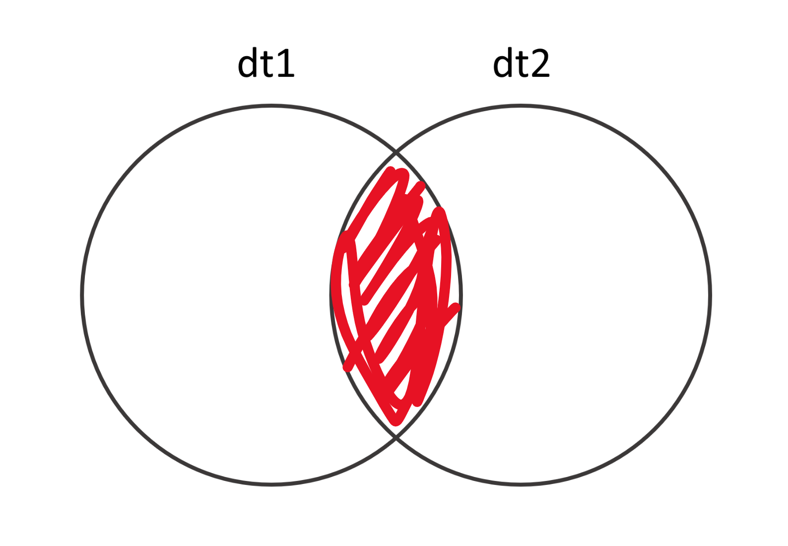
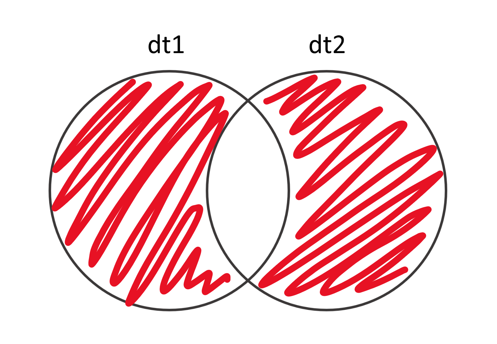
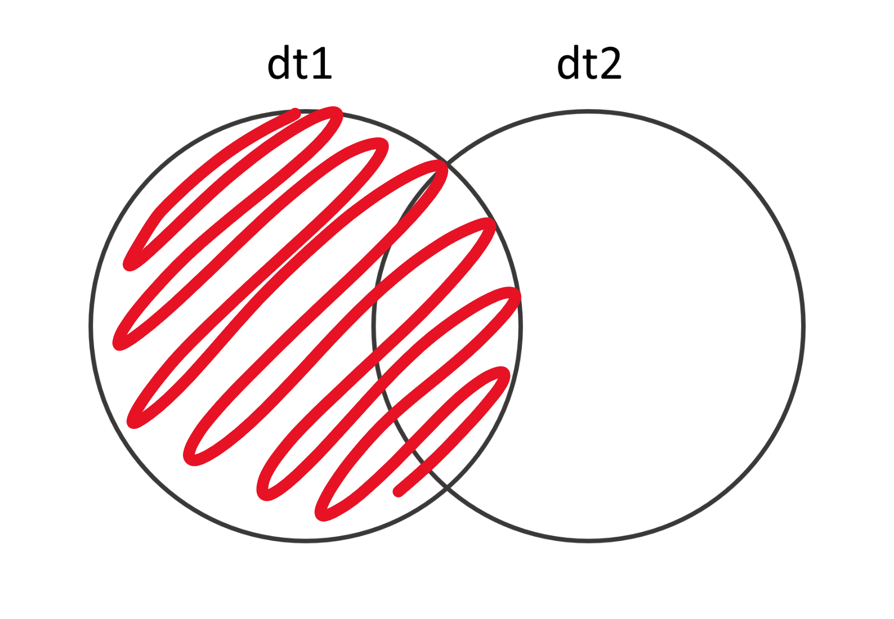
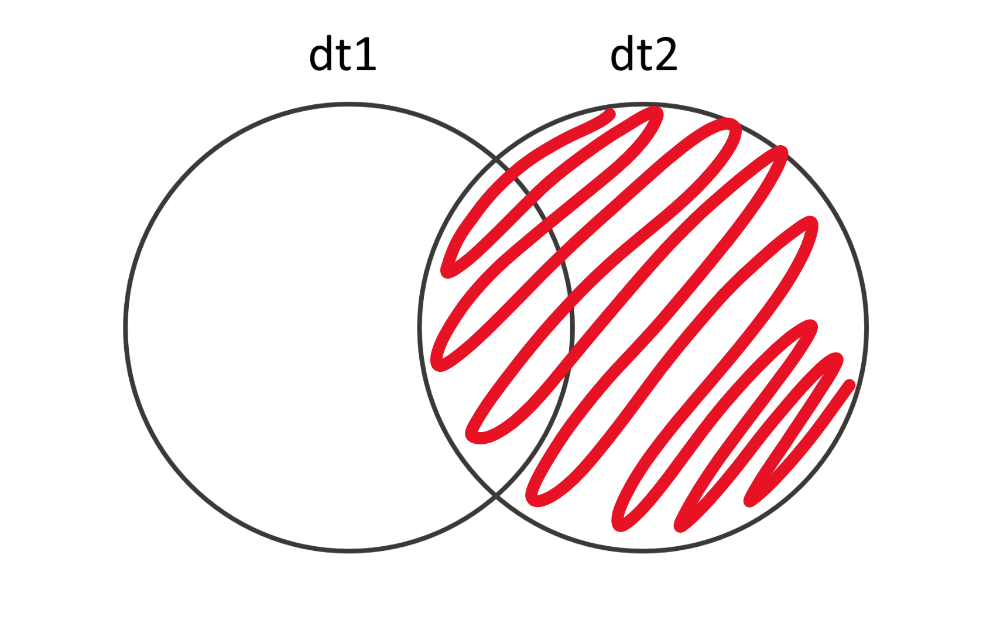

# Слияние и преобразование табличных данных

```{r setup7, include=FALSE}
knitr::opts_chunk$set(echo = TRUE)
```

```{r}
library(data.table)
library(ggplot2)
```

## Слияние и преобразование табличных данных

Один из больших плюсов использования R - то, что с его помощью можно очень гибко менять формат ваших данных - соединять несколько таблиц воедино, считать для них какие-то специфические показатели и преобразовывать. Именно это мы научимся делать в этой главе.


### Соединение двух таблиц в одну: простой случай.

Самый простой случай, в котором нам нужно соединить две таблицы в одну, выглядит так: у вас есть две таблицы (например, по одному от каждого человека, который прошёл ваш эксперимент), которые вы хотите соединить в одну. У обеих таблиц одинаковые имена колонок, и в итоге вы хотите получить одну таблицу, в которой будет столько же колонок, а строки из первоначальных таблиц "подклеены". Это делается с помощью функции `rbind()`. `r` здесь это указание на склейку по строкам (rows). 

Давайте посмотрим:
```{r}
dt1 <- data.table(a = 1:3, b = c('a', 'b', 'c'))
dt2 <- data.table(a = 4:6, b = c('d', 'e', 'f'))
rbind(dt1, dt2)
```
И даже если порядок столбцов различается, всё сработает как надо - `rbind` объединит колонки с одинаковыми именами:
```{r}
dt1 <- data.table(a = 1:3, b = c('a', 'b', 'c'))
dt2 <- data.table(b = c('d', 'e', 'f'), a = 4:6)
rbind(dt1, dt2)
```
Кайф.

Имейте в виду, что `rbind()` не знает, что делать, если в одной таблице колонок больше, чем в другой. Если вы запустите вот этот код у себя, он выдаст ошибку:
```{r, eval = FALSE}
dt1 <- data.table(a = 1:3, b = c('a', 'b', 'c'), c = c(TRUE, FALSE, TRUE))
dt2 <- data.table(b = c('d', 'e', 'f'), a = 4:6)
rbind(dt1, dt2)
```

Неожиданный результат может получиться, и если в колонках, которые надо соединить разные типы данные. Например, здесь в первой таблице числа в колонке `a`, а во второй - логические переменные в той же таблице `a`. В результате `rbind()` постарается привести данные из обеих колонок к одному типу данных. Как превратить 3 или 2 в логическую переменную, непонятно, а вот TRUE можно записать как 1 и FALSE как 0, так что в склеенной таблице в колонке `a` будут лежать числа даже там, где были тру и фолсы. Обращайте на это внимание, не дайте себя обмануть!

```{r, eval = FALSE}
dt1 <- data.table(a = 1:3, b = c('a', 'b', 'c'))
dt2 <- data.table(b = c('d', 'e', 'f'), a = c(TRUE, FALSE, TRUE))
rbind(dt1, dt2)
```

Точно так же, как по строкам, мы можем "склеить" таблицы по колонкам - с помощью функции `cbind()`, где `c` это column, колонка:

```{r}
dt1 <- data.table(a = 1:3, b = c('a', 'b', 'c'))
dt2 <- data.table(c = 4:6, d = c('d', 'e', 'f'))
cbind(dt1, dt2)
```

Когда нам может пригодиться `cbind()`? Например, если у вас есть одна таблица, в которой записан возраст всех испытуемых, и вторая, в которой записаны их ответы на вопросы опросника, и вы хотите получить одну таблицу, в которой есть вся информация вместе. Но! Имейте в виду, что `cbind()` просто склеивает колонки по порядку, никак не проверяя, совпадают ли какие-нибудь значения в строчках.

Давайте приведу пример, что это значит. В dt1 я сохраню возраста испытуемых (в колонку `age`) и их имена (в колонку `name`). А в dt2 - сколько каждый испытуемый решил задачек в моём эксперименте (в колонку `problems_solved`. Мария справилась лучше всех, ничего себе! Наверное, все Марии гениальны...) и снова их имена в колонку `names`.  Обратите внимание: в дата.тейбле с возрастами Василий второй и Вольфганг третий, а в дата.тейбле с данными о решении задачек - наоборот. Что будет, если я соединю эти дата.тейблы в один с помощью `cbind()`?  

```{r}
dt1 <- data.table(age = c(18,20,98), name = c('Maria', 'Vasiliy', 'Wolfgang'))
dt2 <- data.table(problems_solved = c(146, 10, 15), name = c('Maria', 'Wolfgang', 'Vasiliy'))
cbind(dt1, dt2)
```

А вот что: во второй строке будет лежать *возраст* Василия, но количество решённых задачек - *Вольфганга*. А ведь эти два человека явно живут совсем разные жизни! Кроме того, в получившемся дата.тейбле у нас две колонки с одинаковыми именами - тоже проблема. Можно придумать всякие окольные решения (например, сначала отсортировать обе таблицы по колонке имён, а уже потом соединить и удалить дублирующуюся колонку), но есть более простой путь - использовать функцию
`merge()`.

### `merge()` и четыре разных соединения

Более умное соединение по столбцам можно выполнять с помощью функции `merge()`. Давайте для начала посмотрим, что она сделает с нашей проблемой Вольфганга и Василия:
```{r}
dt1 <- data.table(age = c(18,20,98), name = c('Maria', 'Vasiliy', 'Wolfgang'))
dt2 <- data.table(problems_solved = c(146, 10, 15), name = c('Maria', 'Wolfgang', 'Vasiliy'))
merge(x = dt1, y = dt2)
```

Воу! Круто, правда? :D `merge()` совершенно самостоятельно обнаружил, что у в обеих таблицах есть колонка с одинаковым названием - `name` - и использовал её в качестве *колонки ключей*, то есть указателя соответствия между таблицей один и таблицей два. Это происходит по умолчанию - `merge()` находит колонки с одинаковыми именами и соединяет по ним. Но можно задавать колонки ключей и вручную, с помощью аргумента `by`. Это может пригодиться, например, если в таблице несколько колонок с одинаковыми именами, но "ключом" должна быть только одна из них.

Представьте, что наша троица (Мария, Василий и Вольфганг) проходили эксперимент два раза - они пришли в первый раз, сказали нам свой возраст, порешали задачки. Эти данные хранятся в `dt1`. Через день они пришли ещё раз и снова порешали задачки. Эти данные хранятся в `dt2`. То есть, в обеих таблицах есть колонка `problems_solved`, но использовать её как ключ мы совершенно не хотим - более того, мы хотим, чтобы в финальном дата.тейбле осталась и `problem_solved` из первой таблицы, и `problem_solved` из второй таблицы. Тут-то нам и пригодится `by`:

```{r}
dt1 <- data.table(age = c(18,20,98), name = c('Maria', 'Vasiliy', 'Wolfgang'), problems_solved = c(150, 11, 9))
dt2 <- data.table(problems_solved = c(146, 10, 15), name = c('Maria', 'Wolfgang', 'Vasiliy'))
merge(x = dt1, y = dt2, by = 'name')
```

Обратите внимание, что колонка `problems_solved` из `dt1` в соединённом дата.тейбле называется `problems_solved.x`, а `problems_solved` из `dt2` называется `problems_solved.y`. Здесь `x` это первая таблица, которую мы даём на вход функции `merge()`, а `y` - вторая. То есть, команда `merge(dt2, dt1)` поменяла бы названия колонок местами: `problems_solved` из `dt1` в соединённом дата.тейбле стала бы `problems_solved.y`, а `problems_solved` из `dt2` стала бы `problems_solved.x`.

```{block, type = 'rmdtask'}
Вопрос на засыпку: проверьте, что будет, если в последнем примере не уточнять `by = "name"`. Почему?
```

Если вы хотите использовать в качестве ключа несколько колонок сразу, то можно просто передать `by` вектор их имён на вход: `by = c("name", "ID")`.

Вообще лучше всегда эксплицитно уточнять, какую колонку (или какие колонки) надо использовать как ключ - better safe than sorry :)

Кроме того, если одна и та же колонка в двух таблицах называется по-разному, это тоже не проблема. Тогда нужно использовать `by.x` и `by.y` вместо `by`. В `by.x` уточняем, как колонка-ключ называется в первом дата.тейбле, в `by.y` - как во втором. И никаких проблем.

```{r}
dt1 <- data.table(age = c(18,20,98), name = c('Maria', 'Vasiliy', 'Wolfgang'), problems_solved = c(150, 11, 9))
dt2 <- data.table(problems_solved = c(146, 10, 15), imena = c('Maria', 'Wolfgang', 'Vasiliy'))
merge(x = dt1, y = dt2, by.x = 'name', by.y = 'imena')
```


В примере, который мы рассматривали до сих пор, в обеих таблицах были одни и те же испытуемые, или, более глобально, одинаковое количество одних и тех же наблюдений. Это далеко не всегда так. Давайте рассмотрим новый пример: у нас всё ещё эксперимент с решением задач. В первый день мы записываем возраст испытуемых и сколько задач они решили. Это `dt1`. Во второй мы тоже записываем, сколько задач решил каждый испытуемый, но ещё спрашиваем их рост. Это `dt2`. Кроме того, часть испытуемых пришла только в первый день, часть - только во второй, и часть в оба дня. Давайте сделаем такие дата.тейблы:

```{r}
dt1 <- data.table(age = c(18, 20, 98, 40, 19), names = c('Maria', 'Vasiliy', 'Wolfgang', 'Dana', 'Boris'), problems_solved = c(150, 11, 9, 20, 15))
dt1
```

```{r}
dt2 <- data.table(names = c('Maria', 'Vasiliy', 'Wolfgang', 'Katerina', 'Vladimir'), problems_solved = c(150, 11, 9, 11, 40), height = c(160, 180, 173, 167, 178))
dt2
```
Что мы видим? Мария, Василий и Вольфганг пришли в оба дня. Дана и Борис - только в первый. А Катерина и Владимир - только во второй. Две таких таблицы можно соединить четырьмя разными способами. Я не могу найти для них никаких симпатичных названий на русском, так что буду использовать англоязычные названия.

### Inner join



Итак, первый способ соединить две таблицы из нашего примера это inner join (внутреннее слияние?..) - когда мы оставляем только те наблюдения, которые есть в обеих таблицах. То есть, на всех испытуемых, которые пришли только в один из дней, мы забиваем, нам необязательные не нужны, зато склеиваем воедино все данные о троице пришедших в оба дня. По умолчанию `merge()` делает именно inner join:

```{r}
merge(dt1, dt2, by = 'names')
```

### Outer join


Outer join, наоборот, оставит в смёрдженной таблице только те наблюдения, которые уникальны или для первой, или для второй таблицы - то есть, в нашем примере, всех, кроме Марии, Василия и Вольфганга. Чтобы выполнить такое соединение в функции `merge()`, надо уточнить внутри функции `all = TRUE`, вот так:

```{r}
merge(dt1, dt2, all = TRUE, by = 'names')
```

Обратите внимание: во-первых, `problems_solved` из обеих таблиц помечены как `problems_solved.x` и `problems_solved.y`. Во-вторых, мы записывали возраст только в первый день, а рост только во второй. То есть, если испытуемый приходил только в первый день (как Дана и Борис), то про их рост мы ничего не знаем, и в этой колонке у них `NA`. То же самое с возрастом у Катерины и Владимира, которые приходили только во второй день.

### Left join



Left join оставит только те наблюдения, которые есть в первой таблице, и добавит для них информацию из второй таблицы. Для этого надо уточнить в `merge()`, что `all.x = TRUE` - то есть, мы хотим все наблюдения из `x`, из первой таблицы:

```{r}
merge(dt1, dt2, all.x = TRUE, by = 'names')
```
### Right join



Правый джоин - противоположность левого: он оставляет только наблюдения (= испытуемых) из второй таблицы, добавляя для них информацию из первой. Чтобы соединить так, надо в `merge()` уточнить, что `all.y = TRUE`:

```{r}
dt1 <- data.table(age = c(18,20,98), name = c('Maria', 'Vasiliy', 'Wolfgang'), problems_solved = c(150, 11, 9))
```

### Широкие или длинные данные

Ещё один тип преобразования, который нередко нужно совершать, это превращение данных из длинных в широкие или обратно. Что такое длинные или широкие данные?

Мы сейчас всю дорогу работали с широкими данными, в которых каждая строка это наблюдение (например, один испытуемый), а каждая колонка это переменная (например, возраст).

```{r}
wideDt <- data.table(age = c(18,20,98), name = c('Maria', 'Vasiliy', 'Wolfgang'), problems_solved = c(150, 11, 9))
wideDt
```

В длинном формате данных на каждое наблюдение приходится несколько строчек, потому что вместо того, чтобы хранить каждую переменную в отдельной колонке, мы делаем её отдельной строкой. То есть, если про Василия мы знаем его возраст и сколько задач он решил, то в одной строке мы запишем возраст, а в другой - количество решённых задач. Если мы ещё знаем, например, его рост, то и рост станет отдельной строкой. Для этого мы создадим две колонки: `variable` и `value`. В `value` мы будем хранить, собственно, значения (число лет, число решённых задач и т.п.), а в `variable` - уточнять, что за значение мы храним в этой строке. Давай разберём на примере:

```{r}
longDt <- melt(wideDt, id.vars = 'name', measure.vars = c('age', 'problems_solved'))
longDt
```
```{block, type = 'rmdtask'}
Сравните wideDt и longDt. Осознайте, что в обоих содержится одна и та же информация. Примите это.
```

Для разных задач вам могут потребоваться как широкий, так и длинный формат данных, так что очень полезно уметь преобразовать один в другой.

### Из широких в длинные: `melt()`

Как вы могли заметить, в последнем куске кода я использовала функцию `melt()`, чтобы перевести данные из широкого формата в длинный. Для этого мне надо указать колонку-идентификатор (то есть ту, которая остаётся в широком формате.Таких колонок может быть несколько) и колонки с измерениями - то есть те, которые мы как раз хотим переформатировать. Колонка-идентификатор указывается в аргументе `id.vars` с помощью вектора имён колонок, а колонки с измерениями - так же, но в аргументе `measure.vars`.

```{r}
melt(wideDt, id.vars = 'name', measure.vars = c('age', 'problems_solved'))
```

Если я выберу другую колонку в `id.vars`, то получу совсем другой результат:

```{r}
melt(wideDt, id.vars = 'age', measure.vars = c('name', 'problems_solved'))
```

Так как у нас нет испытуемых с одинаковым возрастом, то для каждого значения возраста мы, по сути, храним информацию об одном испытуемом. Давайте сначала сгруппируем людей по возрасту (старше среднего или младше среднего), а потом трансформируем данные в длинный формат по этой группировке:

```{r}
wideDt[, age_above_mean := age > mean(age)]
wideDt
```

Теперь в колонке `age_above_mean` у нас лежит TRUE, если возраст выше среднего в таблице, и FALSE, если ниже. Давайте используем её как `id.vars`.

```{r}
melt(wideDt, id.vars = 'age_above_mean', measure.vars = c('age', 'name', 'problems_solved'))
```

В целом, если указать только `id.vars`, то `melt()` автоматически использует все оставшиеся колонки как `measure.vars`:

```{r}
melt(wideDt, id.vars = 'age_above_mean')
```

При этом мы можем выбрать только часть колонок как `measure.vars`, и тогда остальные в трансформированную длинную таблицу не войдут:

```{r}
melt(wideDt, id.vars = 'age_above_mean', measure.vars = 'problems_solved')
```

### Качественные вина

```{r, echo = FALSE}
wine <- fread("data/winequality-red.csv")

wine[, quality_above_mean := ifelse(quality > mean(quality), 'above', 'below')]
wine_long <- melt(wine, id.vars = 'quality_above_mean')
ggplot(data = wine_long[variable != 'quality'], 
       aes(x = value, color = quality_above_mean, fill = quality_above_mean)) + 
  geom_density(alpha = 0.5) + 
  facet_wrap(~variable, scales = 'free') + 
  theme_classic()
```


```{block, type = 'rmdtask'}
Скачайте с Каггла [датасет о красных винах](https://raw.githubusercontent.com/maria-srv/AnDan2021Start/main/data/winequality-red.csv). Разделите вина на "лучше среднего" и "хуже среднего" по экспертной оценке качества (колонка `quality`) и постройте такой же график, как сверху. Для этого вам нужно будет перевести дата.тейбл в длинный формат.

Подсказка: вам понадобится `geom_density()` и `facet_wrap()` с аргументом `scales = 'free')`.
```


### Из длинных в широкие: `dcast()`

Конечно же, данные можно преобразовать  и обратно из длинного формата в широкий. Это можно сделать с помощью функции `dcast()`, вот так:
```{r}
dcast(longDt, name ~ variable, value.var = "value")
```

То, как именно преобразовать данные, в `dcast()` указывается с помощью формулы, здесь `name ~ variable`. Формула это особый синтаксис, в котором, если попросту, можно прочитать тильду `~` как "в зависимости от". Вы ещё столкнётесь с формулами в разделе про линейные регрессии. Конкретно в `dcast()` слева от тильды мы указываем колонку-идентификатор, а справа - колонку с будущими именами колонок в трансформированной широкой таблице. В аргументе `value.var` мы указываем колонку со значениями, которые нужно будет положить в свежесозданные колонки.

Что, например, можно сделать с `dcast()`? Ну, например, сделать вот так:

```{r, eval = FALSE}
dt <- fread("about_us_eng.csv")
```

```{r, include=FALSE}
dt <- fread("data/about_us_eng.csv")
```

```{r}
hogwartsByMonth <- dt[, .N, by = .(hogwarts, month)]
dcast(hogwartsByMonth, hogwarts ~ month, value.var = "N")
```

Переменная, которую вы указываете до тильды, так и останется колонкой, а вот значения переменной, указанной после тильды, превратятся в имена новых колонок. Смотрите, что произойдёт, если я поменяю их местами:
```{r}
dcast(hogwartsByMonth, month ~ hogwarts, value.var = "N")
```

```{block, type = "rmdtask"}
Посчитайте среднюю длину волос в нашем `dt` в зависимости от того, что они любят, колу или пепси, и того, сколько у них кошек (ответ про "Это личное" уберите). Сделайте табличку, в которой количество кошек меняется по строкам, а любовь к газировке - по столбцам.
```


