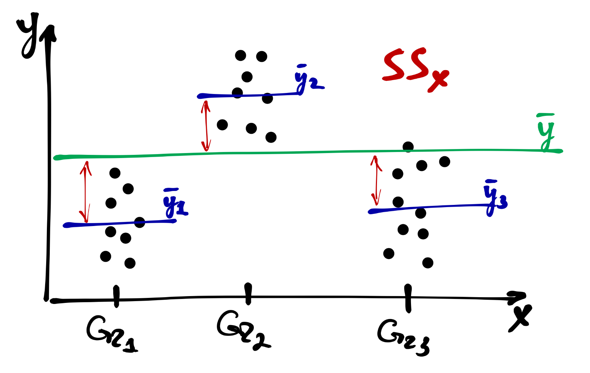
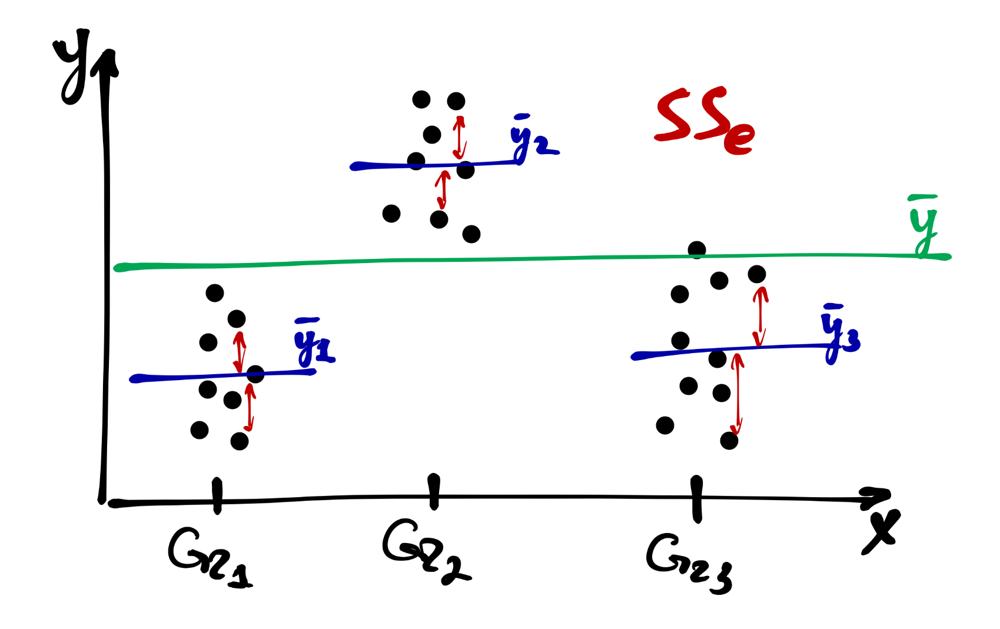
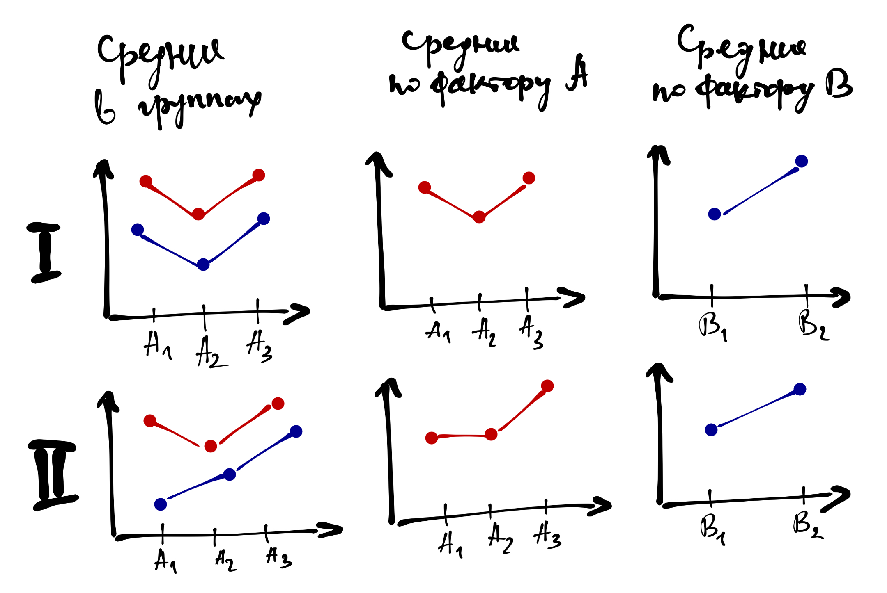

# ANOVA a.k.a. Дисперсионный анализ

## Зачем нужен дисперсионный анализ?

Дисперсионный анализ _(**AN**alysis **O**f **VA**riances)_ нужен, чтобы тестирования гипотзы о влиянии _факторов_ на зависимые переменные. Вернее, более корректно было бы сказать, гипотезы о связях факторов с зависимыми переменными.

С точки зрения данных **фактор --- это категориальная переменная, которая разбивает наши наблюдения на несколько групп**. Например, переменная «экспериментальное условие» или «ступень обучения» (бакалавриат, магистратура, аспирантура) и т.д.

Итак, мы продолжаем сравнивать группы, однако теперь в отличие, например, от t-теста, у нас их больше, чем две. Казалось бы, ну и пофиг? Просто попарно сравниваем все группы друг с другом и обнаруживаем (или нет) искомые различия. Так-то оно, конечно, так --- но ведь это не так…


### Проблема множественных сравнений

Когда мы сравнивали две группы между собой, всё было хорошо. А если у нас больше двух групп? Если их пять? Десять?

**В одном сравнении вероятность ошибки первого рода мы задаем как $0.05$. Когда у нас появляется много сравнений, она существенно возрастает. Почему?**

Мы проводим независимые сравнения, значит вероятности ошибок будут перемножаться[^1]. Если верояность ошибиться в одном сравнении $\alpha$, то вероятность сделать правильный вывод --- $1 - \alpha$. Тогда вероятность сделать правильный вывод в $m$ сравнениях --- $(1 - \alpha)^m$. Отсюда мы можем вывести вероятность ошибиться хотя бы в одном сравнении:

[^1]: По теореме умножения вероятностей.

$$
\mathrm P' = 1 - (1 - \alpha)^m
$$

Пусть у нас есть 3 группы, которые нам надо сравнить друг с другом --- получается необходимо провести три сравнения. Итого вероятность ошибиться получается:

$$
\mathrm P' = 1 - (1 - 0.05)^3 \approx 0.143
$$

Это значительно больше, чем $0.05$. И дальше хуже. Поэтому нужно либо корректировать уровень значимости, либо использовать более мощные методы. Одним из таких методов и является дисперсионный анализ.


### Идея дисперсионного анализа

Идея данного метода состоит в том, что мы не тестируем различия между конкретными группами, а смотрим на _влияние фактора в целом_. Такое влияние будем выражаться в том, что между _хотя бы двумя любыми_ группами будет статистически значимая разница.

Математически мы можем это записать следующим образом:

$$
H_0: \mu_1 = \mu_2 = \dots = \mu_p \\
H_1: \exists \, i, \, j: \mu_i \neq \mu_j,
$$

где $\mu_1, \, \mu_2, \, \dots \, \mu_p$ --- средние значения в группах.


<center>

</center>

Разберемся на примере.


## Однофакторный дисперсионный анализ

Здесь всё просто. У нас один фактор --- категориальная переменная с несколькими уровнями --- и мы хотим узнать, оказывает ли влияние данный фактор на нашу зависимую переменную. Вернее, конечно, правильнее было бы сказать, связан ли данный фактор в нашей зависимой переменной, как мы уже говорили выше.


### Структура изменчивости

Основные характеристики статистических данных --- неопределённость и вариативность. И эта вариативность, он же изменчивость, имеет определенную структуру.

Прежде всего, есть **общая изменчивость**, которая складывается из сумм квадратов отклонений от общего среднего:

$$
SS_\mathrm{t} = \sum_{i=1}^n (\bar y - y_i)^2, \, \mathrm{df_t} = n - 1,
$$

$SS_\mathrm{t}$ --- общая сумма квадратов (Total Sum of Squares), $y_i$ --- наблюдение, $\bar y$ --- среднее по всей выборке, $\mathrm{df_t}$ --- число степеней свободы для общей суммы квадратов.

<center>

</center>

Часть от неё составляет **факторная (межгрупповая) изменчивость** --- это отклонения внутригрупповых средних от общего среднего:

$$
SS_\mathrm{x} = \sum_{j=1}^p (\bar y - \bar y_j)^2, \, \mathrm{df_x} = p - 1,
$$

$SS_\mathrm{x}$ --- факторная сумма квадратов (Factor Sum of Squares), $\bar y_j$ --- среднее в конкретной группе наблюдений, $\bar y$ --- среднее по всей выборке, $\mathrm{df_x}$ --- число степеней свободы для факторной суммы квадратов.

<center>

</center>

Оставшуюся часть составляет **случайная (внутригрупповая) изменчивость**:

$$
SS_\mathrm{e} = \sum_{i=1}^n \sum_{j=1}^p (\bar y_j - y_{ij})^2, \, \mathrm{df_e} = n - p
$$

<center>

</center>


Таким образом, получаем, что

$$
SS_\mathrm{t} = SS_\mathrm{x} + SS_\mathrm{e}
$$


### Тестирование значимости фактора

Почему диперсионный анализ называется именно так? Потому что используя суммы квадратов и степени свободы, мы можем перейти к дисперсиям --- вернее, к **средним квадратам**:

$$
MS_{\mathrm t} = \frac{SS_\mathrm{t}}{\mathrm{df_t}}, \quad
MS_{\mathrm x} = \frac{SS_\mathrm{x}}{\mathrm{df_x}}, \quad
MS_{\mathrm e} = \frac{SS_\mathrm{e}}{\mathrm{df_e}}
$$

$MS_\mathrm{x}$ и $MS_\mathrm{e}$ используются для тестирования значимости фактора. Если зависимости между фактором и целевой переменной нет, то $MS_\mathrm{x} \approx MS_\mathrm{e}$. Ешё раз вспомним, как формулируется статистическая гипотеза:

$$
H_0: \mu_1 = \mu_2 = \dots = \mu_p \\
H_1: \exists \, i, \, j: \mu_i \neq \mu_j,
$$

Для тестирования гипотезы используется следующая статисика:

$$
F_{\mathrm{df_x},\,\mathrm{df_e}} = \frac{MS_\mathrm{x}}{MS_\mathrm{e}} \overset{H_0}{\thicksim} F(\mathrm{df_x}, \, \mathrm{df_e})
$$

Результаты дисперсионного анализа обычно представляются в виде таблицы:

<table border="1">
<tr>
  <th>Источник изменчивости</th>
  <th>$SS$</th>
  <th>$\mathrm{df}$</th>
  <th>$MS$</th>
  <th>$F$</th>
  <th>$p$</th>
</tr>
<tr>
  <th>Фактор</th>
  <td>$SS_\mathrm{x}$</td>
  <td>$\mathrm{df_x}$</td>
  <td>$MS_\mathrm{x}$</td>
  <td>$F_{\mathrm{df_x},\mathrm{df_e}}$</td>
  <td>$p$</td>
</tr>
<tr>
  <th>Случайная</th>
  <td>$SS_\mathrm{e}$</td>
  <td>$\mathrm{df_e}$</td>
  <td>$MS_\mathrm{e}$</td>
  <td></td>
  <td></td>
</tr>
<tr>
  <th>Общая</th>
  <td>$SS_\mathrm{t}$</td>
  <td>$\mathrm{df_t}$</td>
  <td></td>
  <td></td>
  <td></td>
</tr>
</table>


### Данные

Лежат [тут](https://raw.githubusercontent.com/angelgardt/mk_ggplot2/master/sharexp_data.csv). Скачиваются так:

```{r}
share <- read.csv("https://raw.githubusercontent.com/angelgardt/mk_ggplot2/master/sharexp_data.csv")
```

Это данные поведенческого эксперимента, в котором пользователи Android и iOS искали иконки «share» обеих платформ среди универсальных иконок. Короче, зрительный поиск.

Нас будут интересовать следующие переменные:

* `trialtype` --- тип пробы (`tray`/`dots`/`both`)
* `setsize` --- количество стимулов в пробе (`8`/`12`/`16`)
* `time1` --- время первого клика
* `platform` --- платформа смартфона (`Android`/`iOS`)

Будем пытаться ответить на вопрос, какие факторы влияют на время первого клика.

Только первоначально надо предобработать данные, убрав из них пробы типа `both`, так как это экспериментальное условие было задумано для другого анализа:

```{r}
share <- share[share$trialtype != "both", ]
```


### Дисперсионный анализ в R

Для дисперсионного анализа в `R` есть функция `aov()`. Она ожидает на вход *формулу* и датафрейм. Формула задаёт зависимую перменную (`y`) и фактор (`x`). Общий синтаксис будет такой:

```{r, eval=FALSE}
aov(formula = y ~ x, data)
```

Пусть мы хотим понять, влияет ли тип пробы (`trialtype`) на время реакции (`time1`):

```{r}
fit1 <- aov(time1 ~ trialtype, share)
```

Обратите внимание на несколько моментов:

* переменная, которая задаёт фактор, должна быть *факторной* (внезапно), то есть данные должны быть приведены к _длинному формату_; в нашем случае переменная текстовая, поэтому автоматически была приведена к факторному типу
* результаты работы функции `aov()` мы записываем в объект, потому что так удобнее, сейчас мы поймём зачем

Если мы посмотрим на сам объект `fit1`, то мы обнаружим не много полезной информации:

```{r}
fit1
```

Чтобы получить табличку дисперсионного анализа, надо вызвать функцию `summary()` от сохраненного объекта:

```{r}
summary(fit1)
```

На что мы смотрим, чтобы определить значимость фактора? Как и в случае любых статистических методов: на значение статистики, в данном случае $F$, и на p-value. Наблюдаем, что p-value меньше конфенционального 0.05, значит данный фактор статистически значимо связан с зависимой переменной.

Однако в факторе `trialtype` есть только два уровня, и по факту мы сделали что-то сравнимое с t-тестом. Давайте попробуем запилить анову с тремя уровнями фактора. Возьмем переменную `setsize`. Так как это числовая переменная, чтобы анализ корректно отработал, необходимо перевести её в фактор, так как числа в отличии от строк по умолчанию в фактор не трансформируются:

```{r}
fit2 <- aov(time1 ~ factor(setsize), share)
summary(fit2)
```

Логика кода остаётся абсолютно такая же.

Теперь обратим внимание на результат. Да, фактор количества стимулов (`setsize`) значим, но что это значит технически? Что есть хотя бы две группы, которые значимо различаются между собой. Какие — нам не известно. Чтобы это узнать, необходимо провести…


### Post hoc тесты

Post hoc тесты позволяют выяснить, между какими именно группами есть статисически значимые различия. Это не единственный метод, но самый распространенный, поэтому мы рассмотрим его.

Чтобы выяснить, между какими конкретно группами есть различия, нам неизбежно придется выполнить несколько попарных сравнений --- поэтому всё-таки придётся принять меры по предотвращению проблемы множественных сравнений, то есть скорректировать уровень значимости.

Возникает закономерный вопрос: раз уж мы всё равно сравниваем попарно все группы, зачем вообще нам нужен был дисперсионный анализ? Можно же сразу было попарно сравнить и кайфовать! Так-то оно, конечно, так --- но ведь это не так. Post hoc тесты, или попарные сравнения, мы выполняем только в том случае, если обнаружили значимое влияние фактора (предиктора). Напомним себе, что дисперсионный анализ тестирует гипотезу о том, что средние во всех группах равны. Соответственно, если в ходе дисперсионного анализа не обнаруживается значимое влияние фактора на зависимую переменную, у нас нет оснований отклонить эту нулевую гипотезу — следовательно, мы делаем вывод, что между группами нет различий. А раз их нет, то что же тогда тестировать попарными сравнениями?

А вот если фактор получился значимым, то тогда хотя бы две из групп различаются --- естественно, нам хотелось бы знать, какие конкретно. Тогда мы проводим попарные сравнения.

Вообще говоря, попарные сравнения можно проводить любым статистическим тестом, который сравнивает две группы. Просто для именования перечислим следующие возможные варианты:

* наименьшая значимая разница Фишера (Fisher’s Least Significant Difference)
* поправка Бонферрони (Bonferroni correction) или Сидака (Sidak’s correction)
* тест Тьюки (Tuckey’s Honest Significant Difference, HSD)
* тест Стьюдента-Ньюмена-Кьюлса (Student-Newman-Kewls test, SNK)
* тест Даннета для сравнения с контрольной группой (Dunnet’s test)
* критерий Дункана (Dunkan’s test)
* тест Шеффе (Scheffe’s test)

Из всего этого зоопарка мы рассмотрим тест Тьюки, так как он считается разумным компромиссом относительно жёсткости корректировки уровня значимости.

Тест Тьюки выполняется с помощью функции `TukeyHSD()`, которая на вход ожидает объект с результатами дисперсионного анализа:

```{r}
TukeyHSD(fit2)
```

Что мы видим? Табличку попарных сравнений:

* в первой колонке указано, какие группы сравнивались
* во второй --- разница между средними в группах
* третья и четверная --- нижняя и верхняя границы доверительного интервала для разницы средних
* пятая --- p-value, по которому мы делаем статистический вывод

В данном случае все три группы значимо различаются между собой.

<div style="margin-top: 5%">
<div style="padding: 1%; margin: 1%; background-color: #307dce; border-radius: 10px">
<div style="padding-left: 1%; font-weight: bold; color: white">Задание</div>
</div>

<div style="padding: 1% 3% 1% 3%; margin: 2% 1% 1% 1%; background-color: #e0f0fa; border-radius: 10px">

Загрузите [данные](https://raw.githubusercontent.com/angelgardt/hseuxlab-wlm2021/master/data/data_rsf.csv) эксперимента на зрительный поиск (да, опять[^2]).

[^2]: Справедливости ради стоит отметить, что дисперсионный анализ очень часто используется для анализа экспериментальных данных, поэтому поработаем с ними.

В эксперименте испытуемые должны были запоминать слова, обозначающие объекты, а затем искать эти объекты среди похожих других. В данных у нас есть следующие переменные:

* `resp` --- идентификатор респондента
* `group` --- уровень категории слов для запоминания (`base` --- базовая и `super` --- суперординатная)
* `memory_setsize` --- количество слов-категорий для запоминания
* `visual_setsize` --- количество стимулов на экране поиска объектов
* `rt` --- время реакции / обнаружения стимула

Исследуйте, как уровень категории слов для запоминания (`group`) влияет на скорость обнаружения стимула (`rt`).

</div>

</div>


## Многофакторный дисперсионный анализ

Чем ещё хорош дисперсионный анализ? Тем, что можно изучать влияние не только одного фактора, но и нескольких!

<center>

</center>

**Основной эффект** каждого фактора интерпретируется аналогично тому, как это делалось в однофакторном дисперсионном анализе. Если же у нас значимо **взаимодействие**, то это говорит нам о том, что влияние одного фактора на зависимую переменную различается на разных уровнях другого фактора.

Визуализация для понимания того, как оно работает:

<center>

</center>

Вообще значимое взаимодействие факторов --- это двоякая штука. С одной стороны, мы обнаружили интересную закономерность --- возможно, именно ту, которую искали, и это круто. С другой стороны, взаимодействие,

* во-первых, *может маскировать главные эффекты* --- если мы смотрим только на главные эффекты, то теряем часть информации о закономерности
* во-вторых, и это связано с первым пунктом, оно *затрудняет интерпретацию основных эффектов*.

<center>

</center>

Если взаимодействие не значимо, то с интерпретацией главных эффектов трудностей не возникает. Если взаимодействие значимо, то обсуждать главнные эффекты необходимо аккуратно, или не обсуждать вовсе. В частности, нижний ряд рисунков выше показывает, как эффект фактора A частично маскирует эффект фактора B, что отражается во взаимодействии.

Конечно, в модель можно ввести и более двух предикторов, и логика останется та же самая. Но помните, что чем сложнее модель, тем сложнее её интерпретация. А интерпретируя взаимодействие трёх предикторов вовсе можно сойти с ума.

> В связи с этим, есть следующий момент. Когда вы планируете ваше исследование, сразу подумайте, как вы будете анализировать данные --- что будет входить в модель в качестве основных предикторов, что в качестве ковариат, и какие взаимодействия в ней будут. Иначе измерить кучу переменных вы построите модель, результаты которой невозможно будет понять. Дизайн исследования очень тесно связан с аналитикой.

## Многофакторный дисперсионный анализ без взаимодействия в R

В наших данных есть две переменные: `trialtype` и `platform`, влияние которых на время реакции хотелось бы исследовать. Переменная `trialtype` содержит два уровня --- `dots` и `tray`. В факторе `platform` у нас два уровня --- `iOS` и `Android`. Итого, у нас два фактора, в каждом из которых два уровня. Отлично! Поехали!

Построим сначала модель без взаимодействия. Синтаксически несколько факторов в модель указываются через плюс (`+`):

```{r}
fit3 <- aov(time1 ~ trialtype + platform, share)
summary(fit3)
```

Таблица в аутпуте получается аналогичная, только теперь здесь не один, а два фактора. Для каждого рассчитана F-статистика и p-value. В данном случае оба предиктора оказались статистически значимы.


#### Post hoc тесты

Постхоки делаются по той же схеме:

```{r}
TukeyHSD(fit3)
```

Поскольку у нас в каждом факторе два уровня, мы и видим два попарных уравнения с уже скорректированными p-значениями.


<div style="margin-top: 5%">
<div style="padding: 1%; margin: 1%; background-color: #307dce; border-radius: 10px">
<div style="padding-left: 1%; font-weight: bold; color: white">Задание</div>
</div>

<div style="padding: 1% 3% 1% 3%; margin: 2% 1% 1% 1%; background-color: #e0f0fa; border-radius: 10px">

Продолжаем работать в данными эксперимента из предыдущего задания.

<details>
<summary>Напоминалка</summary>

В эксперименте испытуемые должны были запоминать слова, обозначающие объекты, а затем искать эти объекты среди похожих других. В данных у нас есть следующие переменные:

* `resp` --- идентификатор респондента
* `group` --- уровень категории слов для запоминания (`base` --- базовая и `super` --- суперординатная)
* `memory_setsize` --- количество слов-категорий для запоминания
* `visual_setsize` --- количество стимулов на экране поиска объектов
* `rt` --- время реакции / обнаружения стимула

</details>

Как влияют на скорость обнаружения целевого объекта (`rt`) число стимулов на экране (`visual_setsize`) поиска и число категорий для запоминания (`memory_setsize`)?

_Пока тестируем только основные эффекты, взаимодействие включать в модель не надо._

</div>

</div>


### Многофакторный дисперсионный анализ со взаимодействием в R

Чтобы включить в модель взаимодействие, есть два варианта:

* использовать оператор `:`
* использовать оператор `*`

Есть мы используем первый вариант, то синтаксис будет выглядеть так:

```{r}
fit4.1 <- aov(time1 ~ trialtype + platform + trialtype:platform, share)
summary(fit4.1)
```

Если мы пользуемся вторым вариантом, то синтаксис будет выглядеть так:

```{r}
fit4.2 <- aov(time1 ~ trialtype * platform, share)
summary(fit4.2)
```

Результаты получаются идентичные. Оператор `*` просто сокращает строку.


#### Post hoc тесты

Удивительно, но в случае попарных сравнений всё ещё ничего не изменяется:

```{r}
TukeyHSD(fit4.1)
```


<div style="margin-top: 5%">
<div style="padding: 1%; margin: 1%; background-color: #307dce; border-radius: 10px">
<div style="padding-left: 1%; font-weight: bold; color: white">Задание</div>
</div>

<div style="padding: 1% 3% 1% 3%; margin: 2% 1% 1% 1%; background-color: #e0f0fa; border-radius: 10px">

Ещё один заход к данными того самого эксперимента.

<details>
<summary>Напоминалка</summary>

В эксперименте испытуемые должны были запоминать слова, обозначающие объекты, а затем искать эти объекты среди похожих других. В данных у нас есть следующие переменные:

* `resp` --- идентификатор респондента
* `group` --- уровень категории слов для запоминания (`base` --- базовая и `super` --- суперординатная)
* `memory_setsize` --- количество слов-категорий для запоминания
* `visual_setsize` --- количество стимулов на экране поиска объектов
* `rt` --- время реакции / обнаружения стимула

</details>

Возьмите модель из предыдущего задания и дополните её взаимодействием факторов. Итого в модель должны быть включены факторы `visual_setsize` и `memory_setsize`, а также из взаимодействие `visual_setsize:memory_setsize`. В качестве зависимой переменной остаётся `rt`.

Какие выводы можно сделать из полученной модели?

</div>

</div>


## Важность аггрегации данных

А теперь посмотрим на то, что мы наделали. Для этого взглянем на структуру данных:

```{r}
str(share)
```

У нас аж 10800 наблюдений, а среди переменных есть `id`, которая идентификатор испытуемого.

```{r}
unique(share$id)
```

Наблюдаем, что у нас 36 испытуемых. И если мы напишем немного кода, то посмотрим, сколько у нас было наблюдений на каждое экспериментальное условие:

```{r}
library(data.table)
```

```{r}
share <- data.table(share) # делаем data.table, чтобы синтаксис работал
share[, .N, by=.(id, trialtype, setsize, platform)]
```

Видим, что у нас 50 проб на каждое условие. А содержательно для нас каждый испытуемый --- это отдельное наблюдение, а эти 50 проб мы делали для более точных измерений. То есть, наши данные надо аггрегировать, усреднив наблюдения по каждому респонденту.

Зачем? Чтобы у нас не случилось косяков с мощностью. R не знает о группировке наших данных, поэтому считает каждую строчку датасета отдельным наблюдением. В результате этого у нас возрастает статистическая мощность теста, но это искусственное увеличение мощности.

Усредним данные и сравним результаты:

```{r}
share_aggregated <- share[, .(mean_rt = mean(time1)), by = .(id, trialtype, setsize, platform)]
```

```{r}
share_aggregated
```

```{r}
fit5 <- aov(mean_rt ~ trialtype * platform, share_aggregated)
summary(fit5)
```

Ого! Значимость пропала!

Для сравнения вспомним, какие результаты были без усреднения:

```{r}
summary(fit4.1)
```

Наблюдаем, что воистину значимость одного фактора и взаимодействия пропала. Это как раз потому, что у нас упала мощность, но эти результаты корректнее отражают реальное положение дел.


## Итоги

Мы с вами познакомились с одним из самых популярных методов анализа данных. Конечно, мы не вникали с его детали и не смогли охватить все возможности. Например, за рамками остались такие темы как контрасты и дисперсионный анализ в повторными измерениями. Однако уверенно разобравшись в рассмотренных моделях, вы сможете погрузить в более сложные методы. Удачи!
